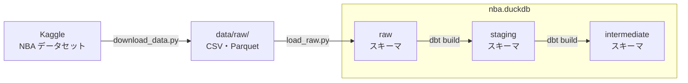

# nba-dbt-playground

NBA のデータを使った dbt のサンプルプロジェクトです。

- データの変換: [dbt](https://docs.getdbt.com/) v2（PyPI の `dbt` パッケージ）
- データベース: [DuckDB](https://duckdb.org/)（ローカルのファイル）

> Data: [NBA.com](https://www.nba.com/) via [Kaggle](https://www.kaggle.com/datasets/eoinamoore/historical-nba-data-and-player-box-scores)

## 使い方

データはリポジトリに含めていないため、Kaggle から取得します。データが大きいので、ダウンロードには時間とディスクの空きが必要です。

1. [uv](https://docs.astral.sh/uv/) をインストールする
2. [Kaggle CLI の認証手順](https://github.com/Kaggle/kaggle-cli/blob/main/docs/README.md#authentication)に沿って、Kaggle の認証を設定する
3. 次のコマンドで、データの取得・DuckDB への読み込み・dbt の実行を行う

```sh
uv sync
uv run python scripts/download_data.py   # data/raw/ に取得する
uv run python scripts/load_raw.py        # nba.duckdb の raw スキーマに読み込む
uv run dbt build
```

ダウンロードが途中で失敗した場合は、`uv run python scripts/download_data.py --force` で取り直します。

### SQL の書式を確認する

dbt v2 に組み込みのリンターを使います。設定は `.sqlfluff` にあります。

```sh
uv run dbt lint     # 確認する
uv run dbt format   # 書式を自動で直す
```

### テーブルの中身を見る

DuckDB の CLI で `nba.duckdb` を開きます。

```sh
uv run duckdb -readonly nba.duckdb
```

```sql
SHOW ALL TABLES;                    -- テーブルの一覧
SUMMARIZE staging.stg_games;        -- 列ごとの型・最小値・最大値・null の割合など
```

- `uv run duckdb -ui nba.duckdb` で、ブラウザの画面から操作することもできる。UI は読み取り専用では開けない
- 開いたまま `dbt build` を実行すると、ロックが取れずに失敗する。閉じてから実行する

## データの流れ



## ディレクトリ構成

```
scripts/
  download_data.py   Kaggle からデータを取得して data/raw/ に置く
  load_raw.py        data/raw/ のファイルを nba.duckdb の raw スキーマに読み込む
models/staging/      raw スキーマのデータを整える（列名の統一、シーズンや試合の種類の付与、期間の絞り込み）
models/intermediate/ staging を組み合わせて、元データの欠けを補う
macros/              シーズン・試合の種類を gameId から求めるマクロなど
tests/               モデルの前提を確かめるテスト
seeds/               本拠地アリーナの座標など、元データにない表（取得に使ったクエリも置く）
charts/              dbt Charts のボード（グラフの種類ごとのディレクトリ）
dbt_charts.yml       dbt Charts の設定（ボードが読む DuckDB のファイル）
dbt_project.yml      dbt の設定（staging で残すシーズンの開始年など）
profiles.yml         DuckDB への接続先（nba.duckdb）。リポジトリのルートで dbt を実行すると読まれる
.sqlfluff            dbt lint の設定
```

## データについて

- 使用データ: [NBA Dataset: Box Scores and Stats (1947 - Today)](https://www.kaggle.com/datasets/eoinamoore/historical-nba-data-and-player-box-scores)
  - 作成者: [Eoin A. Moore](https://www.kaggle.com/eoinamoore)
  - ライセンス: [CC0 1.0](https://creativecommons.org/publicdomain/zero/1.0/)
  - 元の統計データの出典: [NBA.com](https://www.nba.com/)
- 期間: 既定で 2000-01 シーズン以降に絞る
  - `dbt_project.yml` の変数 `start_season_year` で変えられる
- 注意点
  - シュート位置の座標は、2019-20 シーズンから入っている。2019-20 は、2020 年 2〜3 月を中心に欠けている
  - オールスター・一部のプレシーズン・ごく一部のレギュラーシーズンの試合は、選手の成績やシュートにはあるが、試合の一覧（`stg_games`）にない
  - 選手の成績の所属チーム（`team_id`）は、元データで空の行がある。補ったものは `int_player_game_stats` にあるが、一部は補えず空のまま

## ライセンス

- コード: [MIT License](LICENSE)
- データ
  - Kaggle のデータセット: このリポジトリには含めていない
    - [CC0 1.0](https://creativecommons.org/publicdomain/zero/1.0/) で公開されているが、元の統計データは NBA.com 由来
    - 使うときは [NBA.com の利用規約](https://www.nba.com/termsofuse)も確認する
  - `seeds/nba_arenas.csv`: [Wikidata](https://www.wikidata.org/) から取得した（[CC0 1.0](https://creativecommons.org/publicdomain/zero/1.0/)）
    - 取得日と変換の内容は `seeds/_seeds.yml` に書いている
- このリポジトリは個人のサンプルで、NBA・NBA.com とは関係ない
